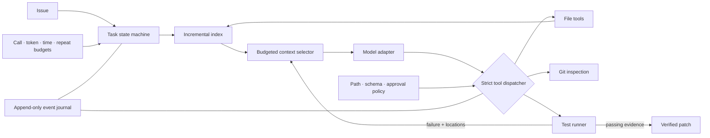

# ForgeMCP — Repository-Level Coding Agent

[](https://github.com/Tz22z/ForgeMCP/actions/workflows/ci.yml)
[](https://www.python.org/)
[](https://modelcontextprotocol.io/)
[](LICENSE)

ForgeMCP accepts a software issue, gathers repository evidence, edits code through
policy-checked tools, and refuses to declare success until tests verify the patch.

It is intentionally not a collection of MCP integrations. The project isolates three
runtime questions that determine whether a coding agent can solve multi-file work
reliably:

1. How should the runtime close the loop between planning, action, and verification?
2. Which repository evidence earns a place in a fixed context budget as code changes?
3. How can tools remain useful without becoming an unrestricted shell?

**Stack:** Python · MCP · Tree-sitter · OpenAI Responses API · Docker · Pytest · SQLite

## Auditable benchmark snapshot

The checked-in formal benchmark uses eight synthetic repository defects, three paired
trials, the pinned `gpt-5.2-2025-12-11` snapshot, identical 12-model-call budgets, and
external graders. Each arm therefore contains 24 attempts with raw per-run records.

| Formal-8 aggregate | Baseline | Hybrid | Hybrid change |
| --- | ---: | ---: | ---: |
| Strict solve rate | 17/24 (70.8%) | 17/24 (70.8%) | +0.0 pp |
| Average tool calls | 9.42 | 7.79 | −17.3% |
| Average input tokens | 22,258 | 16,521 | −25.8% |
| Repeated-read ratio | 30.2% | 25.6% | −4.6 pp |
| Estimated cost per solve | $0.0649 | $0.0506 | −22.0% |

All 48 patches passed their hidden graders and no run changed a protected test. The
strict score is lower because seven runs per arm exhausted the 12-call budget before a
`succeeded` terminal state. See the
[formal report](benchmarks/formal/results/summary.md), its six raw reports, and the
[protocol](docs/evaluation.md) for hashes and limitations.

The original local Git object database and 120-instance raw records were lost. The
historical headline summary remains in
[`benchmarks/reconstructed-swebench-verified-120.summary.json`](benchmarks/reconstructed-swebench-verified-120.summary.json)
as provenance only; it is not presented as a reproduced result.

## See it work in under a minute

```bash
git clone https://github.com/Tz22z/ForgeMCP.git
cd ForgeMCP
python -m venv .venv
source .venv/bin/activate
pip install -e '.[dev]'
forge demo
```

The offline demo starts from a real two-file checkout bug, runs the same runtime with a
recorded model transcript, edits `shop/pricing.py` and `shop/checkout.py`, executes
independent assertions, and prints the verified diff. It needs no API key.

```text
succeeded
Files changed          2
Tool calls             5
Model calls            6
Tests                  passed
```

See [the demo walkthrough](docs/demo.md) for the issue, expected trace, and interview
talk track.

## Runtime architecture



### Verified execution loop

- A typed state machine makes `planning`, `acting`, `verifying`, and terminal outcomes
  observable rather than implicit in prompt text.
- Tool-call, model-call, input-token, output-token, wall-time, and repeated-action limits
  are checked centrally before work proceeds.
- Every edit advances a mutation generation. Completion is valid only if the current
  generation has a passing test result.
- Failed verification is compacted, its file/line evidence is fed back into retrieval,
  and the model gets another bounded repair turn.
- Exhaustion returns `budget_exhausted`; it is never silently converted into success.

### Repository context that follows the code

- A persistent SQLite index stores content hashes, Tree-sitter symbols, imports, parser
  provenance, and read counters.
- Refreshes reparse only changed files and remove deleted entries.
- An edit invalidates the changed file plus dependency consumers before the next model
  turn.
- Ranking combines issue/path terms, symbols, dependents, recent Git diffs, test pairs,
  and traceback locations.
- Snippets are packed under a hard estimated-token budget. Long tool output keeps a
  bounded head/tail plus a durable reference to the full observation.

This follows the broader context-engineering principle of treating context as a finite
attention budget and favoring compact, just-in-time evidence over exhaustive dumps; see
[Anthropic's context engineering discussion](https://www.anthropic.com/engineering/effective-context-engineering-for-ai-agents).

### Restricted tools

ForgeMCP exposes nine deliberately narrow tools: file listing, bounded reads, search,
exact replacement, explicit file creation/overwrite, content-hashed deletion, Git diff,
Git status, and tests.

- Strict Pydantic schemas reject unknown arguments.
- All paths resolve beneath one repository root; absolute paths and traversal fail.
- `.git`, `.forgemcp`, and environment files are protected from model writes.
- Test arguments use an allowlist, subprocesses receive argument vectors without a
  shell, and high-risk operations enter the approval path.
- Docker mode blocks network by default, drops every capability, sets
  `no-new-privileges`, uses a read-only root filesystem, and caps CPU, memory, PIDs, and
  temporary storage.

The fuller threat model is in [SECURITY.md](SECURITY.md).

## Live usage

Create an issue file:

```markdown
# Cache entries survive invalidation

Deleting a project must invalidate both the project cache and its derived permission
cache. Add a regression test and preserve the public API.
```

Then run:

```bash
export OPENAI_API_KEY=...
forge index /path/to/repository
forge context "cache entries survive invalidation" --repo /path/to/repository --tokens 6000
forge run issue.md --repo /path/to/repository --model gpt-5.2 --docker
```

The OpenAI adapter uses the Responses API with strict custom function definitions,
function-call outputs, and `previous_response_id`, following the
[official OpenAI Responses API reference](https://developers.openai.com/api/reference/python/resources/responses/methods/create).

## MCP server

```bash
cp mcp.json.example mcp.json
# Set FORGEMCP_ROOT in the copied file, then configure your MCP client.
forge serve
```

The server exposes:

| MCP tool | Purpose | Mutates repository |
| --- | --- | ---: |
| `forge_index` | Incrementally refresh symbols and dependencies | No |
| `forge_select_context` | Preview ranked snippets and token use | No |
| `forge_run_issue` | Run the full edit-and-test loop | Yes |
| `forge_inspect_run` | Read a compact event timeline and final result | No |

MCP repository arguments are relative to `FORGEMCP_ROOT`; absolute paths and escapes
are rejected at the server boundary.

## Configuration

Copy `.forgemcp.toml.example` to `.forgemcp.toml` in a target repository. Important
settings:

```toml
[agent]
model = "gpt-5.2"
context_strategy = "hybrid" # or "baseline" for the ablation
context_token_budget = 12000

[budget]
max_tool_calls = 30
max_model_calls = 12
max_input_tokens = 80000
max_output_tokens = 20000
max_wall_seconds = 900
max_repeated_actions = 2

[tools]
approval_mode = "on-risk"
approved_tools = [] # Add "delete_file" only after explicit review
execution_mode = "docker"
allow_network = false
test_command = ["python", "-m", "pytest", "-q"]
```

## Reproduce an evaluation

Evaluation graders live outside the agent workspace. The harness also hashes visible
tests before and after each run, so changing either public or hidden scoring conditions
cannot count as a solve.

```bash
forge evaluate benchmarks/your-manifest.json \
  --strategy baseline \
  --model gpt-5.2 \
  --output artifacts/baseline.json

forge evaluate benchmarks/your-manifest.json \
  --strategy hybrid \
  --model gpt-5.2 \
  --output artifacts/hybrid.json
```

Pass explicit per-million-token prices if cost estimates are needed; ForgeMCP does not
hard-code volatile model pricing. Reports include solve rate, tool/model calls, token
usage, estimated cost per solve, repeated-read ratio, grader status, and changed files.
See [evaluation protocol](docs/evaluation.md).

For a low-cost live integration check, use the
[four-case pilot](benchmarks/live-small/README.md). For the current auditable result,
use the [formal eight-case suite](benchmarks/formal/README.md), which checks in its
manifest, external graders, three paired trials, raw records, and input/report hashes.
Neither synthetic suite is presented as SWE-bench.

## Development

```bash
make quality     # lint + formatting + tests + strict mypy
make demo        # deterministic end-to-end repair
make image       # build the runtime container
```

The current suite covers budgets, transitions, event redaction, scanners, symbol
extraction, incremental invalidation, context packing, tool policy, output truncation,
worktree isolation, Docker flags, model adaptation, automatic verification, MCP root
confinement, and hidden-test grading.

## Project boundaries

- This is a research-quality agent runtime, not a promise that arbitrary generated code
  is safe to execute on a production host.
- The token estimator is deliberately provider-independent and conservative; provider
  usage returned by the API remains the source of truth for accounting.
- Tree-sitter falls back to Python's AST when a parser is unavailable, keeping offline
  runs functional.
- Historical benchmark percentages are reconstructed summaries. Fresh claims should
  ship with immutable manifests, raw per-instance records, model IDs, and pricing inputs.

## License

MIT
